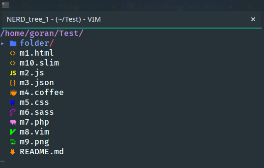

This is workaround for devicons colors [issue](https://github.com/ryanoasis/vim-devicons/issues/250)
I took the code from **[Zeorin](https://github.com/zeorin)** from his vimrc
**[the code](https://github.com/zeorin/dotfiles/blob/e01cebf/.vimrc#L864-L900a)**

In my attempt, I had some errors and I have shortend the code so it can work for me.
I am a beginner coder so don't judge :)

~~This works when you give color names for the icons. I tried to make it work with hex as well but
I get ``W18: Invalid character in group name`` and I don't know how to make *if/else* to match
regular words or hex.~~

Switched to hex coloring, now any hex color goes. ;)

You can try this by copying the file to your .vim directory and source it in .vimrc under the
NERDTree configuration, that is how I have it.

Vim **termguicolors must be enabled**

I hope this issue gets fixed soon.
